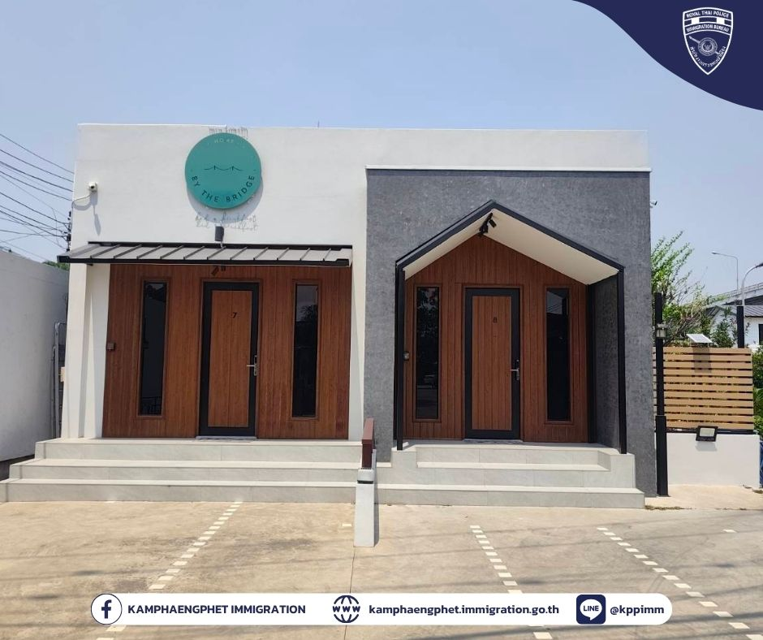
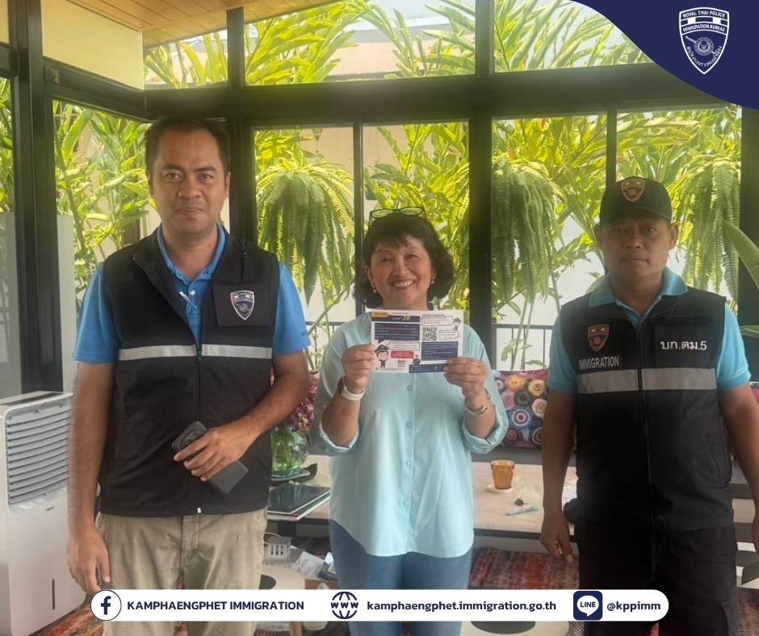
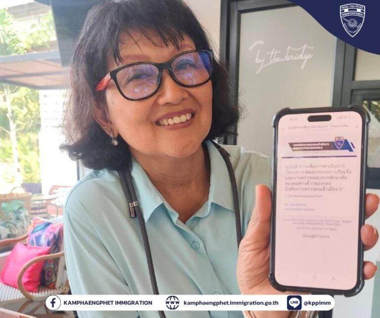

# ตรวจสอบการแจ้งที่พักอาศัยของคนต่างด้าว ตาม ม.38

วันที่ 22 พฤษภาคม พ.ศ. 2569 เวลา 10.00 น.

**พ.ต.ท.บดินทร์ แสงสิทธิศักดิ์** สว.ตม.จว.กำแพงเพชร สั่งการให้ชุดสืบสวน นำโดย **ร.ต.อ.มานิตย์ บางหลวง** รอง สว.ตม.จว.กำแพงเพชร ลงพื้นที่ตรวจสอบการแจ้งที่พักอาศัยของคนต่างด้าว ตาม ม.38 แห่ง พ.ร.บ.คนเข้าเมือง พ.ศ. 2522 และกฎหมายที่เกี่ยวข้องในพื้นที่รับผิดชอบ

เจ้าหน้าที่เข้าตรวจสอบบับเบิ้ลโฮม ห้องพักเลขที่ 659 ต.วังบัว อ.คลองขลุง จว.กำแพงเพชร

## ผลการตรวจสอบ

ผลการตรวจสอบพบว่า มีการแจ้งที่พักอาศัยของคนต่างด้าวภายใน 24 ชั่วโมง ตามที่กฎหมายกำหนด และไม่พบการกระทำผิดตามกฎหมายอื่นแต่อย่างใด

